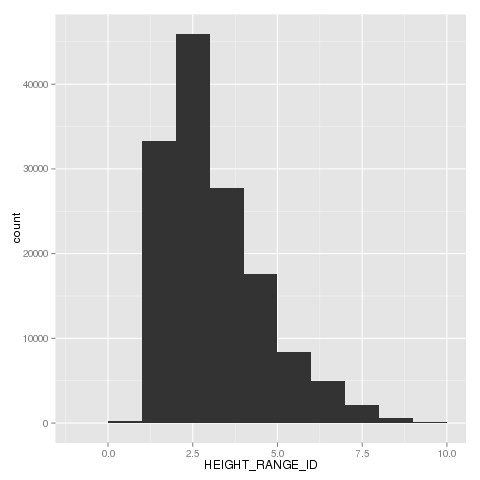
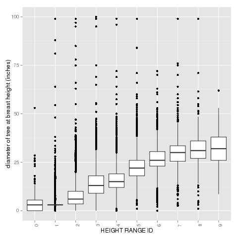
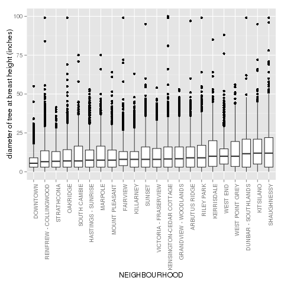
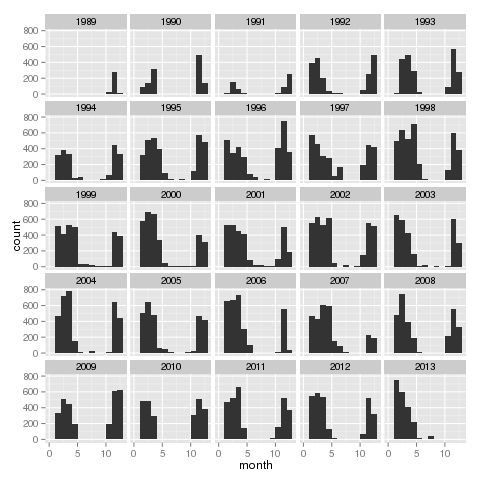
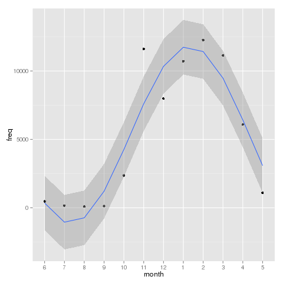

A quick look at city owned trees in the city of Vancouver
========================================================

The dataset on city owned trees was downloaded from City of Vancouver [Open Data Catalogue](http://data.vancouver.ca/datacatalogue/streetTrees.htm).

The page also contains the legend for column names.

### What do we have?
```{r load}
cityTreesDF <- read.delim("cityTreesDF.txt", header=T, sep=";")

# what is the size of this database (after cleaning)
dim(cityTreesDF)

# what are the names of neighbourhoods?
levels(cityTreesDF$NEIGHBOURHOOD_NAME)
```

Some graphs of interest
-------------------------
### Height Class
The height of trees in the city is classified into 10 categories, with the following name:
- **HEIGHT_RANGE_ID**: 0-10 for every 10 feet (e.g., 0 = 0-10 FT, 1=10-20,…,10 = 100+ FT)

And to show visually the distribution of tree height:



### Height and Diameter, should be related no?
Just as a sanity check, it should be that height and diameter are correlated.  The median is a good measure for comparison since the data seem to have a lot of outliers.



### Diameter and City Neighborhood.  Is there a pattern?
Actually, there is.  From the graph below we see that the "older" and "richer" residential neighborhoods like Shaunessey, Kitsilano, and Dunbar have bigger trees, whereas Downtown, being newer and primarily commercial, have smaller trees.



### Is tree planting seasonal?
To explore this question, first I looked at the frequency of trees planted in each month by year, and the figure seem to suggest that the seasonal pattern is consistent each year.



Then, I aggregated the years, and looked at only monthly frequencies.  I fitted a sinusoidal curve by glm to assess the pattern.  Tree planting seems to peak around January, and cease in July!



